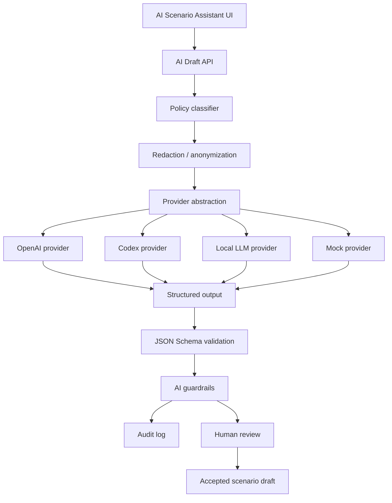

# AI architektura

**Status:** Baseline dokumentace

AI vrstva SIM systému je podpůrná. Pomáhá s návrhem syntetických scénářů, validací konzistence, návrhem fault injection, návrhem load testu, vysvětlením scénáře, tvorbou demo scénáře a dokumentací scénáře. Nesmí plánovat reálnou bojovou misi, vybírat cíle, prioritizovat cíle pro zásah, doporučovat použití síly, navádět prostředky, optimalizovat útok ani poskytovat taktická bojová doporučení.

## Provider abstraction

Každý provider implementuje stejné rozhraní: capability discovery, request validation, structured output generation, timeout/cancel, safety metadata a audit metadata. Provider nesmí obcházet policy classifier ani schema validation.

## AI Scenario Assistant

AI Scenario Assistant přijímá slovní zadání, účel scénáře, povolené bloky, limity objektů a délky, provider preference a informaci, zda je povolen externí provider. Výstupem je draft, nikoliv spuštěný scénář.

## Structured output a schema validation

Výstup AI musí odpovídat `ai-scenario-draft.schema.json` a obsahovat `scenarioPatch`, policy výsledek, prohibited content check a vysvětlení. Draft se následně validuje proti `scenario.schema.json`.

## Guardrails

Guardrails blokují targeting, navádění, zbraňové workflow, taktické instrukce, reálná operační data, secrets a pokusy obejít syntetické omezení.

## Audit, redaction a human-in-the-loop

Prompty a odpovědi se auditují redigovaně. Před uložením nebo spuštěním musí člověk draft přijmout. Externí AI lze úplně vypnout; local-only režim používá lokální LLM nebo mock provider.
