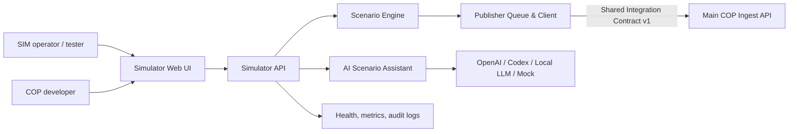

# System context

**Status:** Baseline dokumentace

SIM je samostatná aplikace a vůči COP vystupuje jako externí datový zdroj. COP není součástí tohoto repozitáře.

## Odpovědnosti SIM

- Generuje syntetická data a označuje je jako `SYNTHETIC`.
- Validuje scénáře, eventy a AI návrhy proti schématům.
- Publikuje nebo dry-runuje eventy podle konfigurace.
- Vede audit runtime, publisheru a AI operací.

## Odpovědnosti mimo SIM

- COP ingest, canonical fusion, COP state management a distribuce.
- Autorizace COP zdrojů na straně hlavního systému.
- NATO symbol rendering a downstream uživatelské workflow.
