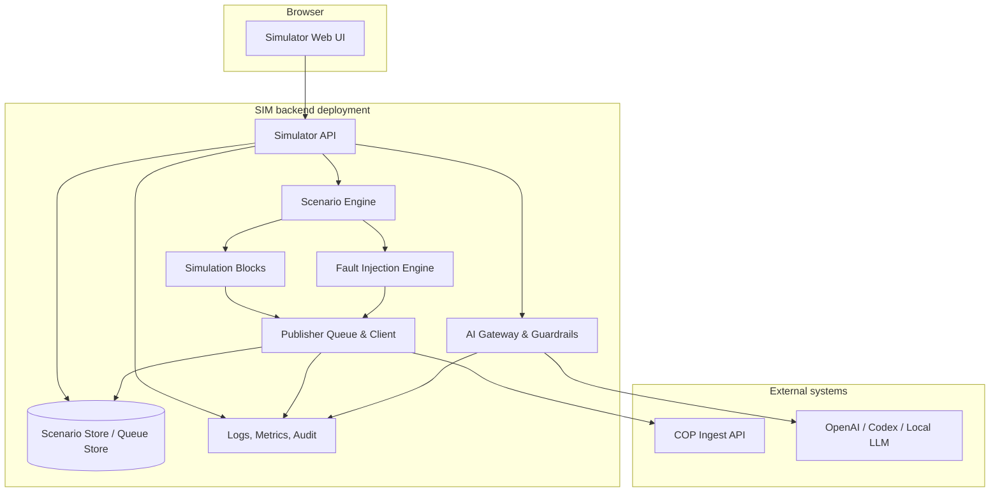

# Container view

**Status:** Baseline dokumentace

## Kontejnery

- `simulator-web`: UI pro dashboard, builder, control, publisher monitor, fault injection, konfiguraci a AI asistenta.
- `simulator-api`: REST API, auth enforcement, validation, runtime orchestration a audit.
- `simulation-core`: deterministický runtime a lifecycle scénáře.
- `simulation-blocks`: generátory syntetických bloků.
- `publisher-client`: persistent queue, idempotency, retry/backoff, dry-run a mock mode.
- `ai-assistant`: provider abstraction, guardrails, structured outputs a human review.
