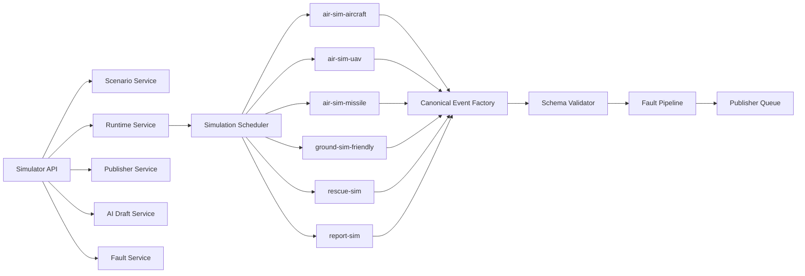

# Component view

**Status:** Baseline dokumentace

## Komponentové pravidlo

Každý simulační blok vrací pouze syntetické domain eventy. Canonical envelope, syntetické označení, idempotency metadata a publisher rozhodnutí se přidávají mimo blok, aby byl kontrakt jednotný.
