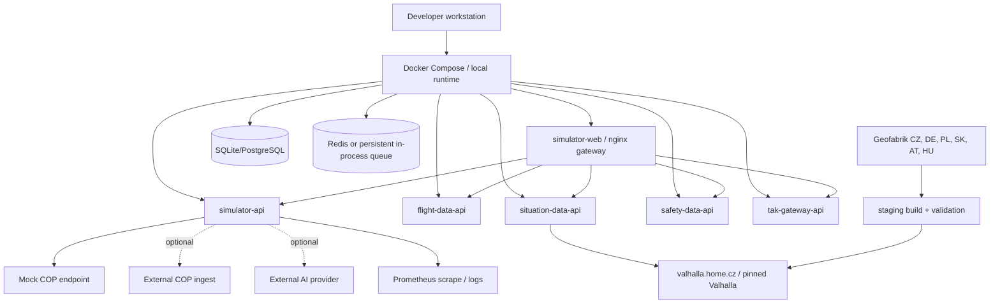

# Deployment view

**Status:** Baseline dokumentace

## Režimy

- **Local dry-run:** bez COP a bez externí AI; používá mock provider a validuje payloady lokálně.
- **Local with mock COP:** publisher posílá na mock endpoint a testuje retry/backoff a error model.
- **Lab with COP:** publisher posílá na nakonfigurované COP ingest URL s TLS a zvoleným auth režimem.
- **Local-only AI:** AI běží přes lokální LLM nebo mock provider, externí provider je vypnutý.

## Gateway

`simulator-web` publikuje port `5020` a funguje jako nginx gateway pro
server-to-server provider API. Backend služby se v Docker síti oslovují podle
service names přes Docker DNS. Gateway musí přeresolvovat upstream jména za
běhu, protože recreate backend kontejneru může změnit jeho interní IP adresu.

Produkční routing je oddělený datový subsystém na `valhalla.home.cz`. Build
probíhá mimo aktivní release, vytváří ČR + 75 km graf a přepíná jediný atomický
`current` pointer až po úplné kandidátní validaci. Podrobnosti a rollback jsou v
[Valhalla Production Runbook](../runbooks/15_VALHALLA_PRODUCTION.md).
