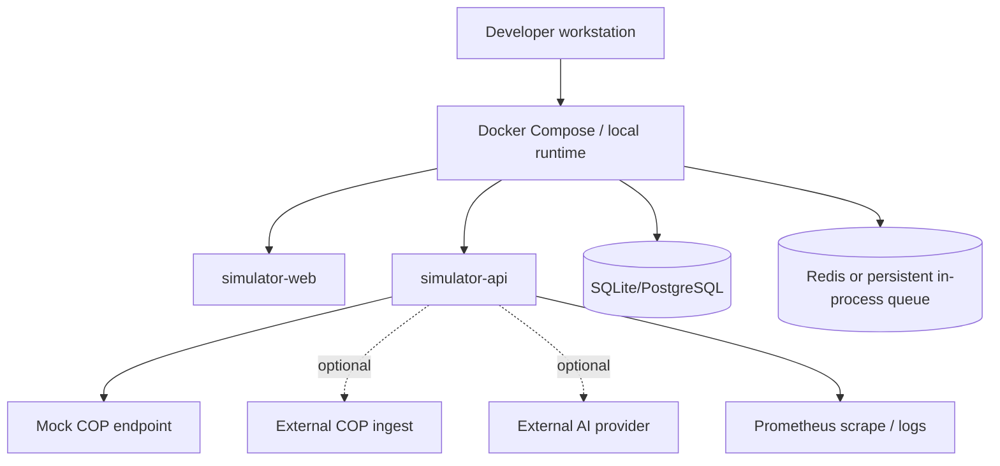

# Deployment view

**Status:** Baseline dokumentace

## Režimy

- **Local dry-run:** bez COP a bez externí AI; používá mock provider a validuje payloady lokálně.
- **Local with mock COP:** publisher posílá na mock endpoint a testuje retry/backoff a error model.
- **Lab with COP:** publisher posílá na nakonfigurované COP ingest URL s TLS a zvoleným auth režimem.
- **Local-only AI:** AI běží přes lokální LLM nebo mock provider, externí provider je vypnutý.
