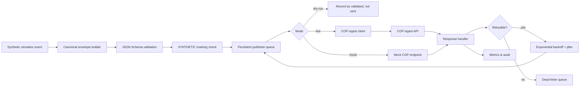

# Publisher architecture

**Status:** Baseline dokumentace

Publisher je samostatná komponenta odpovědná za validaci, persistentní uložení, idempotency, retry/backoff, batch sending, dry-run a dohled nad publikací do COP.

## Zásady

- Nevalidní event nesmí opustit SIM proces.
- Každý event má `eventId`, `correlationId`, `X-Idempotency-Key` a `producerTimestamp`.
- Retry musí respektovat rate limit a `Retry-After`, pokud ho COP vrátí.
- Okamžité zastavení publikace musí zastavit live odesílání, ale nesmí smazat queue.
