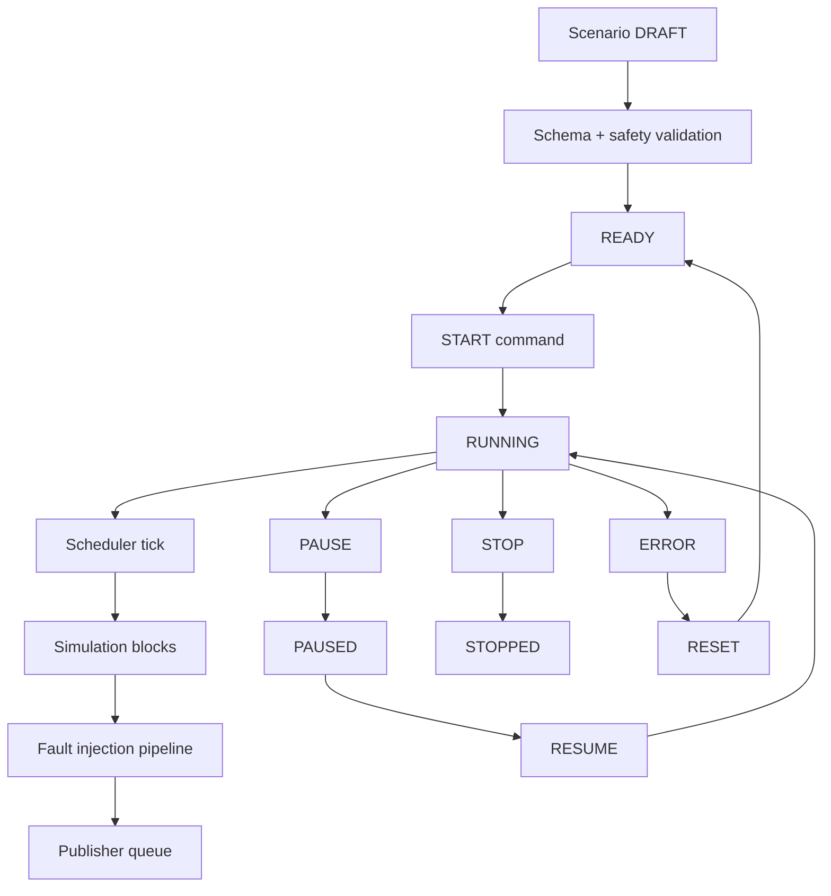
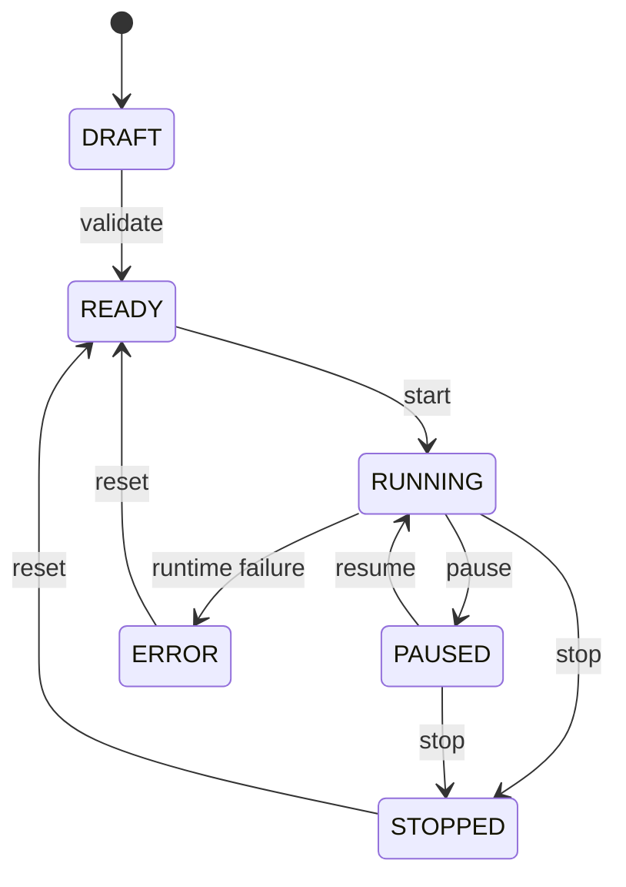

# Scenario engine architecture

**Status:** Baseline dokumentace

Scenario engine řídí lifecycle scénáře, časování bloků, deterministický seed, update rate a předání eventů do publisher pipeline.

## Determinismus

Scénář je reprodukovatelný pouze při stejné verzi engine, stejné konfiguraci bloků, stejném seed a stejné konfiguraci fault injection. Tyto hodnoty musí být součástí runtime audit záznamu.
