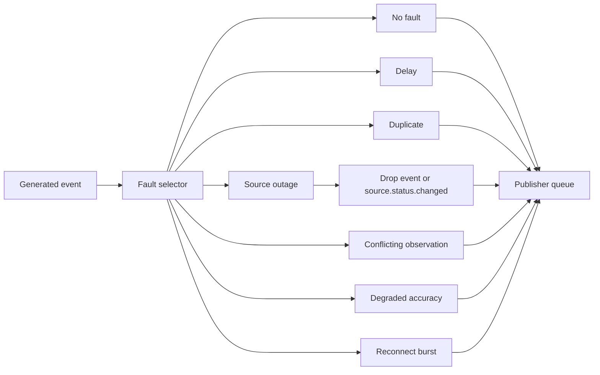

# Fault injection architecture

**Status:** Baseline dokumentace

Fault injection je řízená vrstva mezi generováním syntetických eventů a publisher queue. Slouží k testování odolnosti COP ingestu, ne k modelování reálných útoků nebo taktických postupů.

## Povolené fault typy

- `DELAY`: zpoždění publikace.
- `DUPLICATE`: opakované doručení stejné idempotentní události.
- `SOURCE_OUTAGE`: výpadek zdroje a volitelný `source.status.changed` event.
- `CONFLICT`: syntetické konfliktní pozorování pro test COP korelace.
- `DEGRADED_ACCURACY`: zhoršená přesnost a confidence.
- `RECONNECT_BURST`: dávkové doručení po obnově.
- `BATCH_REPLAY`: řízený replay historicky uložených syntetických eventů.
