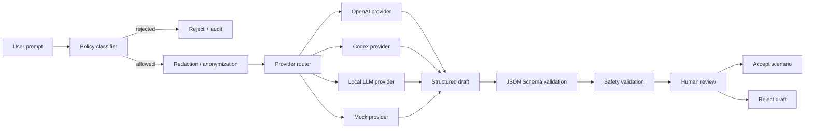

# AI assisted scenario planning

**Status:** Baseline dokumentace

AI vrstva pomáhá pouze s návrhem syntetických scénářů, jejich vysvětlením, validací, fault injection návrhy, load test návrhy a dokumentací. AI nikdy nespouští scénář přímo a nesmí poskytovat reálné bojové plánování.

## Výchozí governance

Externí AI provider je konfigurovatelný a lze ho vypnout. Každý AI návrh musí být auditovaný, validovaný proti JSON Schema a potvrzený člověkem před uložením jako spustitelný scénář.
