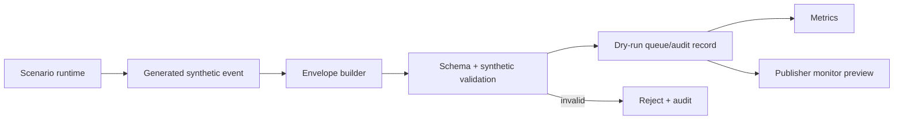

# Dry-run mode

**Status:** Baseline dokumentace

Dry-run je povinný režim SIM systému. Umožňuje spustit scénář, generovat eventy, validovat canonical envelope a měřit runtime bez odesílání do COP.

## Chování

- Neprovádí se HTTP volání na COP.
- Zachovává se stejná validace jako v live režimu.
- Publisher monitor ukazuje, co by bylo odesláno.
- Contract testy mohou porovnat dry-run payloady proti JSON Schema.
- Dry-run nesmí maskovat chybějící `SYNTHETIC` označení.
