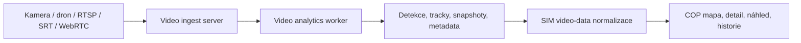

# Video Analytics Source Contract

**Status:** návrh pro další rozvoj. Dokument popisuje cílovou integrační hranici
mezi samostatným video ingest / video analytics serverem, SIM a COP. Nejde ještě
o implementovaný veřejný API kontrakt.

## Cíl

SIM nemá být primární platforma pro zpracování každého video framu. Pro kamerové
feed'y, dronové přenosy a budoucí vlastní senzorové uzly má vzniknout samostatná
serverová aplikace, která:

- přijímá video streamy a řeší protokoly, reconnect, autorizaci a retenci,
- provádí základní video analytiku a tracking,
- vytváří normalizované detekce, události, snapshoty a klipy,
- předává do SIM pouze strojově čitelný výsledek,
- nepublikuje surové video přímo do běžných COP mapových vrstev.

SIM zůstává integrační a normalizační vrstva pro COP. COP zobrazuje live náhled,
detekce, historii, jistotu a vazbu na mapu, ale neprovádí těžké zpracování videa.

## Cílová architektura



## Odpovědnosti komponent

### Video ingest server

- Přijímá RTSP, SRT, WebRTC, RTMP nebo HLS podle typu zdroje.
- Řeší autentizaci zdroje, stav streamu, reconnect a health.
- Zajišťuje krátkodobé ukládání snapshotů a důkazních klipů.
- Vystavuje autorizovaný náhled pro COP pouze přes server-side token nebo
  krátkodobý podepsaný URL.
- Nepředává raw video do SIM jako hlavní datový tok.

Vhodná implementační báze pro protokolovou část je samostatný media gateway
server typu MediaMTX. Pro vyšší výkon může být analytics worker oddělený a
škálovaný podle GPU kapacity.

### Video analytics worker

- Spouští detekční, klasifikační a tracking modely.
- Vytváří události typu `smoke_detected`, `fire_visible`, `flood_extent`,
  `road_blocked`, `vehicle_detected`, `person_group`, `boat_detected`,
  `infrastructure_damage_possible`.
- Přidává `confidence`, `modelVersion`, `processingLatencyMs`, `trackId` a
  odkaz na snapshot/clip.
- Pokud jsou dostupná přesná metadata kamery, provádí georeferenci detekce.
- Pokud metadata nejsou dostatečná, předává pouze informaci "pozorováno v záběru"
  a sektor / footprint kamery, ne přesný bod na mapě.

Supervision je vhodný nástroj pro práci s detekcemi, trackingem, zónami,
anotacemi a měřením nad výsledky modelu. Není to ale kompletní video platforma;
ingest, storage, autorizaci a provozní dohled musí řešit samostatná služba.

### SIM

- Přijímá jen normalizované výsledky z video analytics serveru.
- Normalizuje zdroj, typ události, geometrii, jistotu a čas.
- Udržuje historii událostí, tracků a vazbu na snapshoty/klipy.
- Předává COP jednotný mapový kontrakt přes provider vrstvu.
- Obohacuje video události o kontext, pokud je to bezpečné a auditovatelné
  (například nejbližší obec, správní oblast, počasí nebo známé riziko).

### COP

- Zobrazuje streamy, detekce, camera footprint, historii a detail.
- Neprovádí inference nad raw video.
- Operátorovi zobrazuje jistotu, zdroj, čas, retenci a informaci, zda je poloha
  přesná, odhadnutá nebo jen odvozená ze záběru.
- Pro live preview používá autorizovaný odkaz od video ingest serveru, ne přímý
  přístup ke zdrojové kameře.

## Georeference a přesnost

Přesné položení detekce do mapy vyžaduje alespoň:

- časově synchronizovaný timestamp,
- polohu kamery nebo dronu,
- výšku nad terénem,
- heading / azimut,
- pitch a roll platformy,
- gimbal yaw / pitch / roll, pokud existuje,
- FOV a základní intrinsics kamery,
- informaci o zoomu,
- stav stabilizace a kvalitu metadat.

Preferovaný standard pro pohyblivé platformy je MISB/KLV nebo ekvivalentní
telemetrický stream. Bez těchto údajů SIM nesmí vydávat přesný bod detekce.
Správný výstup je v takovém případě:

- poloha zdrojové kamery,
- pozorovací sektor / footprint,
- typ detekce,
- jistota,
- text `locationPrecision=observed_in_frame`.

## Návrh objektového modelu

```json
{
  "schema": "sim.video.event.v1",
  "eventId": "video-event-20260705-000001",
  "streamId": "drone-alpha-01",
  "sourceAuthority": "internal_verified",
  "observedAt": "2026-07-05T12:00:00.000Z",
  "receivedAt": "2026-07-05T12:00:01.200Z",
  "eventType": "smoke_detected",
  "severity": "warning",
  "confidence": 0.82,
  "geometry": {
    "type": "Point",
    "coordinates": [14.421, 50.087]
  },
  "locationPrecision": "estimated",
  "camera": {
    "lat": 50.0869,
    "lon": 14.4208,
    "heightM": 320,
    "headingDeg": 73,
    "pitchDeg": -18,
    "horizontalFovDeg": 64
  },
  "media": {
    "snapshotUrl": "/video-data/api/v1/events/video-event-20260705-000001/snapshot",
    "clipUrl": "/video-data/api/v1/events/video-event-20260705-000001/clip"
  },
  "model": {
    "name": "smoke-detector",
    "version": "2026-07-05",
    "processingLatencyMs": 180
  }
}
```

## Předpokládané SIM endpointy

Budoucí API povrch má být samostatný od současných mapových providerů:

```http
GET /video-data/api/v1/streams
GET /video-data/api/v1/streams/{streamId}/status
GET /video-data/api/v1/streams/{streamId}/snapshot
GET /video-data/api/v1/streams/{streamId}/footprint
GET /video-data/api/v1/events?bbox=west,south,east,north
GET /video-data/api/v1/events/{eventId}
GET /video-data/api/v1/events/{eventId}/snapshot
GET /video-data/api/v1/events/{eventId}/clip
GET /video-data/api/v1/tracks?streamId=...
```

COP mapové vrstvy mají nadále používat provider model. Video data se do něj
promítnou jako vrstvy typu:

- `public.video.streams`,
- `public.video.camera_footprints`,
- `public.video.detections`,
- `public.video.tracks`.

## Bezpečnost a retence

Video data jsou citlivější než běžné mapové vrstvy. Proto platí:

- všechny ingest a preview endpointy jsou server-to-server,
- každý stream má vlastní ACL a audit,
- snapshoty a klipy mají krátkou retenci podle klasifikace,
- raw video se neposílá do veřejného klienta bez explicitního oprávnění,
- externí cloud inference je vypnutá, dokud není schválená bezpečnostní politika,
- události musí být auditovatelné podle zdroje, modelu, času a verze pravidel.

## Otevřené body

- Vybrat protokolovou bázi pro ingest server.
- Rozhodnout, zda `video-data-api` bude samostatný proces v SIM monorepu, nebo
  samostatný repozitář s vlastním deploymentem.
- Definovat storage pro snapshoty a krátké klipy.
- Definovat minimální metadata pro dronové kamery.
- Připravit OpenAPI až ve chvíli, kdy začne implementace.
- Navrhnout COP UX pro camera footprint, live preview, historii a důkazní klipy.
