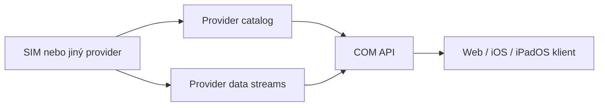

# Public Provider Model

## Role systémů

SIM je datový provider. Dodává mapové produkty, metadata zdrojů, health a provozní cache. COM je centrální zobrazovací aplikace. COM rozhoduje, co uživatel uvidí, jak se vrstva autorizuje a jak se vykreslí.

Provider nesmí předpokládat, že webový klient bude volat jeho endpointy přímo. Tokeny, partnerské zdroje a interní streamy zůstávají na serveru COM.

## Základní principy

- Vrstva je uživatelský produkt, například `public.mobile.network`.
- Source je technický zdroj nebo upstream, například `mobile_network_model`, `ctu_nettest` nebo `osm_postgis`.
- `enabled=true` u source znamená pouze to, že provider zdroj provozuje. Neznamená to, že jej COM má ukázat jako běžnou mapovou vrstvu.
- COM ukládá a dotazuje katalogové `layerId`, ne interní provider `sourceId`.
- Jeden source může být jen diagnostický vstup a nemá se ukazovat jako běžná vrstva.
- Katalog je autoritativní zdroj pro strom vrstev, default viditelnost, cache, refresh a bezpečnostní metadata.
- Feature odpovědi musí nést atribuci, licenci, stale stav, varování a modelové disclaimery.
- Dense vrstvy mají postupně přejít na tile výstup; bbox GeoJSON je vhodný pro řídké a středně husté vrstvy.

## Tok dat

Klient nemá znát `sourceId`, token partnera ani interní upstream. Klient ukládá pouze COM `layerId` a uživatelské filtry.

## Bezpečnost

Veřejné vrstvy mohou mít `audience=public`, ale to neznamená veřejné čtení všech provider endpointů. Partnerská a diagnostická data musí být čtena server-side a filtrována podle oprávnění v COM.

TAK/CoT a budoucí partnerské feedy musí mít vypnuté veřejné čtení a read token předaný pouze backendu COM.

## Cache

Provider odpovídá za cache vůči externím zdrojům. COM může mít vlastní krátkou viewport cache, ale nesmí způsobit, že každý uživatel vyvolá nový dotaz na externí upstream.

Každý provider má publikovat minimálně:

- `cacheTtlSeconds`
- `refreshSeconds`
- `stale` nebo `staleAt`
- health stav zdrojů
- per-source cache metriky, pokud pracuje s externími upstreamy

## Role source

Provider používá `sourceRole`, aby COM nemusel hardcodovat význam názvů:

- `final`: finální uživatelský datový produkt.
- `aggregate`: sloučený výstup z více vstupů, pokud ještě není finálním produktem.
- `reference`: referenční kontext.
- `input`: technický vstup do modelu.
- `projection`: kompatibilní projekce jiné služby.
- `mock`: syntetická/testovací data.
- `diagnostic`: pouze diagnostika.

Příklad: běžná mobilní vrstva je `public.mobile.network` z provider layer `mobile_network` a source `mobile_network_model`. `mobile_coverage_model`, `ctu_nettest`, `ctu_stationary_mobile` a OSM komunikační věže jsou vstupy/provenance, ne další běžné vrstvy „Mobilní síť“.
