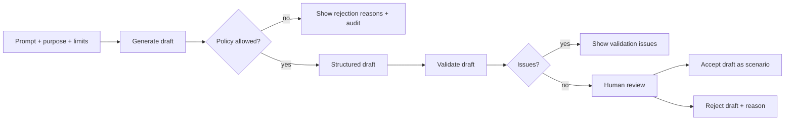

# AI Scenario Assistant UI

**Status:** Baseline dokumentace

AI Scenario Assistant je panel pro tvorbu a validaci syntetických scenario draftů. Výstup AI není spuštěný scénář; je to návrh vyžadující kontrolu a potvrzení.

## Povinné prvky panelu

- Textové zadání uživatele.
- Výběr účelu scénáře: latency test, load test, degraded connectivity, conflict test, demo, documentation.
- Výběr povolených simulačních bloků.
- Limit objektů.
- Limit délky scénáře.
- Provider preference a indikace, zda je povolen externí provider.
- Akce `generate draft`.
- Akce `validate draft`.
- Akce `accept draft`.
- Akce `reject draft`.
- Zobrazení důvodů odmítnutí.
- Auditní stopa: provider, policy decision, validation result, reviewer action.

## Workflow

## Bezpečnostní chování

Panel musí odmítnout požadavky na targeting, navádění, použití síly, optimalizaci útoku, vyhýbání detekci nebo reálné bojové plánování. Důvody odmítnutí se zobrazí stručně a uloží do auditu.
