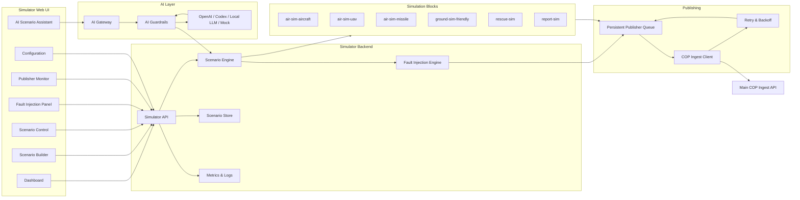

# Profesionální technické zadání pro CODEX: Samostatný simulační systém s AI podporou

**Pracovní název:** COP Air & Situation Simulator  
**Dokument:** Zadání pro vývoj samostatné simulační aplikace  
**Verze:** v1.0  
**Určení:** samostatné zadání pro CODEX / vývojářský tým  
**Primární výstup CODEX:** samostatná webová aplikace s UI pro řízení simulačních scénářů, AI asistentem, API publisherem a kontrakty pro nezávislou integraci s hlavním COP systémem.  
**Vazba na hlavní systém:** hlavní systém je samostatná aplikace. Simulátor je pouze externí SourceSystem a publikuje syntetická data přes definované API.

---

## 1. Cíl simulačního systému

Simulační systém generuje syntetická situační data pro testování hlavní COP platformy. Jeho účelem je umožnit vývojářům a testerům ověřovat ingest, canonical model, korelaci, distribuci, NATO symbol renderer, latenci, degraded/offline režim a datovou kvalitu bez nutnosti připojení reálných zdrojů.

Simulátor musí mít vlastní UI pro:

- tvorbu scénářů,
- řízení běhu simulace,
- konfiguraci datových bloků,
- AI asistované plánování syntetických scénářů,
- fault injection,
- dohled nad publikací do hlavního systému,
- monitoring a logy.

---

## 2. Bezpečnostní a funkční vymezení

Simulátor smí generovat pouze syntetická data pro testování COP.

Simulátor nesmí implementovat:

- reálné bojové plánování,
- targeting,
- navádění,
- řízení zbraní,
- doporučení použití síly,
- vyhýbání detekci,
- taktické postupy proti protivníkovi,
- bojovou gamifikaci,
- NATO symbol renderer hlavní aplikace.

AI asistent simulátoru smí pomáhat pouze s návrhem syntetických scénářů, testů, fault injection a dokumentace. Každý AI návrh musí projít policy kontrolou a lidským potvrzením před spuštěním.

---

## 3. Architektonická role simulátoru

Simulátor je samostatná aplikace. Vůči hlavní COP aplikaci vystupuje jako externí zdroj dat.

```text
Simulator UI
  -> AI Scenario Assistant
  -> Scenario Engine
  -> Simulation Blocks
  -> Fault Injection Engine
  -> Publisher Queue
  -> Main COP Ingest API
```

Simulátor neprovádí:

- canonical fusion,
- COP state management,
- COP distribuci,
- NATO symbol rendering,
- policy filtering hlavní aplikace.

Tyto funkce patří hlavnímu COP systému.

---

## 4. Cílová architektura



---

## 5. Simulační bloky

### 5.1 `air-sim-aircraft`

Generuje syntetické aircraft tracky.

Data:

- object ID,
- platform type,
- affiliation,
- lat/lon,
- altitude,
- speed,
- heading,
- vertical rate,
- status,
- position accuracy,
- confidence,
- source metadata.

Scénáře:

- direct transit,
- patrol pattern,
- circular pattern,
- entry/exit from AOI,
- temporary track loss,
- track restoration.

### 5.2 `air-sim-uav`

Generuje syntetické UAV/drone tracky.

Data:

- UAV ID,
- UAV class,
- lat/lon,
- altitude,
- speed,
- heading,
- connection status,
- optional battery/fuel state,
- optional signal quality,
- confidence.

Scénáře:

- loiter,
- survey pattern,
- low-speed movement,
- degraded position accuracy,
- source outage,
- restoration.

### 5.3 `air-sim-missile`

Generuje syntetické missile tracks jako testovací vzdušné objekty.

Data:

- track ID,
- object type `MISSILE_TRACK`,
- lat/lon,
- altitude,
- speed,
- heading,
- simplified phase/state,
- confidence,
- timestamp.

Omezení:

- trajektorie musí být zjednodušené,
- nepoužívat fyzikálně přesné modely navádění,
- nepoužívat modelování účinnosti,
- nepoužívat reálné taktické doporučení.

### 5.4 `ground-sim-friendly`

Generuje friendly ground tracks.

### 5.5 `rescue-sim`

Generuje krizové a záchranné incidenty.

### 5.6 `report-sim`

Generuje manuální textová hlášení.

---

## 6. UI simulační aplikace

### 6.1 Dashboard

Zobrazuje:

- aktuální scénář,
- stav běhu,
- stav připojení k hlavnímu COP systému,
- počet aktivních objektů,
- počet odeslaných událostí,
- velikost publisher queue,
- latenci ingest API,
- chybovost,
- stav AI providerů.

### 6.2 Scenario Builder

Umožňuje:

- vytvořit scénář,
- zvolit geografickou oblast,
- vybrat simulační bloky,
- nastavit počty objektů,
- nastavit update rate,
- nastavit seed,
- nastavit délku scénáře,
- uložit scénář jako šablonu.

### 6.3 Scenario Control

Ovládání:

- start,
- pause,
- resume,
- stop,
- reset,
- step mode,
- dry-run mode.

### 6.4 AI Scenario Assistant

Panel pro slovní zadání scénáře.

Funkce:

- převod textového zadání na JSON scénář,
- validace scénáře,
- vysvětlení účelu scénáře,
- návrh fault injection,
- návrh load testu,
- návrh demo skriptu,
- odmítnutí nebezpečných požadavků.

### 6.5 Fault Injection Panel

Možnosti:

- delay,
- duplicate events,
- source outage,
- conflicting observations,
- degraded accuracy,
- reconnect burst,
- batch replay.

### 6.6 Publisher Monitor

Zobrazuje:

- poslední odeslané eventy,
- odpovědi hlavního ingest API,
- retry operace,
- idempotency keys,
- rate limits,
- chybové odpovědi,
- payload preview.

### 6.7 Configuration

Nastavení:

- URL hlavního COP systému,
- autentizační režim,
- token/mTLS/OIDC client credentials,
- sourceSystemId,
- výchozí klasifikace syntetických dat,
- výchozí releasability,
- AI provider mode,
- limity generování.

---

## 7. AI podpora simulátoru

### 7.1 Podporovaní provideři

- `openai-provider`,
- `codex-provider`,
- `local-llm-provider`,
- `mock-ai-provider`.

### 7.2 Povolené AI use-cases

AI může:

- vytvořit návrh syntetického scénáře,
- doporučit počet objektů pro zátěžový test,
- navrhnout update rate,
- navrhnout fault injection,
- vytvořit sample JSON,
- vysvětlit, co scénář testuje,
- navrhnout testovací očekávání,
- generovat dokumentaci scénáře,
- pomoci s tvorbou kódu/testů přes Codex.

### 7.3 Zakázané AI use-cases

AI nesmí:

- plánovat reálné bojové mise,
- vybírat cíle,
- doporučovat útok/obranu,
- navrhovat navádění,
- navrhovat taktické překonání protivníka,
- optimalizovat trajektorii pro zásah,
- hodnotit účinnost zbraní.

### 7.4 AI workflow

```text
Prompt
  -> AI Policy Classifier
  -> Data redaction
  -> Provider selection
  -> Structured scenario draft
  -> JSON Schema validation
  -> Safety validation
  -> Human review
  -> Save scenario
  -> Optional run
```

### 7.5 AI output schema

```json
{
  "draftId": "uuid",
  "title": "Synthetic air situation latency test",
  "purpose": "LATENCY_TEST|LOAD_TEST|CONFLICT_TEST|DEGRADED_CONNECTIVITY|DEMO",
  "safetyScope": "SYNTHETIC_COP_TEST_ONLY",
  "scenarioPatch": {
    "durationSeconds": 900,
    "seed": 123456,
    "blocks": []
  },
  "expectedObservations": [],
  "policyCheck": {
    "allowed": true,
    "reasons": []
  },
  "prohibitedContentCheck": {
    "targeting": false,
    "weaponGuidance": false,
    "realOperationalAdvice": false
  }
}
```

---

## 8. Simulator API

Všechna API simulátoru běží pod prefixem:

```text
/api/v1
```

### 8.1 Scenario API

#### `POST /api/v1/scenarios`

Vytvoření scénáře.

Request:

```json
{
  "name": "Air situation basic",
  "description": "Synthetic mixed air situation for COP ingest test",
  "area": {
    "type": "BBOX",
    "bbox": [14.0, 49.8, 15.0, 50.3]
  },
  "durationSeconds": 900,
  "seed": 123456,
  "blocks": [
    {
      "blockId": "air-sim-aircraft",
      "enabled": true,
      "objectCount": 40,
      "updateRateHz": 1,
      "patterns": ["DIRECT", "PATROL"]
    }
  ],
  "faults": []
}
```

Response:

```json
{
  "scenarioId": "uuid",
  "status": "DRAFT",
  "createdAt": "2026-05-18T12:00:00Z"
}
```

#### `GET /api/v1/scenarios`
#### `GET /api/v1/scenarios/{scenarioId}`
#### `PATCH /api/v1/scenarios/{scenarioId}`
#### `DELETE /api/v1/scenarios/{scenarioId}`

### 8.2 Runtime Control API

```http
POST /api/v1/scenarios/{scenarioId}/start
POST /api/v1/scenarios/{scenarioId}/pause
POST /api/v1/scenarios/{scenarioId}/resume
POST /api/v1/scenarios/{scenarioId}/stop
POST /api/v1/scenarios/{scenarioId}/reset
POST /api/v1/scenarios/{scenarioId}/step
```

Runtime response:

```json
{
  "scenarioId": "uuid",
  "runtimeId": "uuid",
  "state": "RUNNING|PAUSED|STOPPED|ERROR",
  "startedAt": "2026-05-18T12:00:00Z",
  "generatedEvents": 1000,
  "publishedEvents": 980,
  "queuedEvents": 20
}
```

### 8.3 Fault Injection API

#### `POST /api/v1/scenarios/{scenarioId}/faults`

```json
{
  "type": "DELAY|DUPLICATE|SOURCE_OUTAGE|CONFLICT|DEGRADED_ACCURACY|RECONNECT_BURST",
  "targetBlockId": "air-sim-uav",
  "startAtSecond": 300,
  "durationSeconds": 120,
  "parameters": {
    "delayMs": 5000
  }
}
```

### 8.4 Publisher API

```http
POST /api/v1/publisher/test-connection
POST /api/v1/publisher/send-sample
GET /api/v1/publisher/status
GET /api/v1/publisher/queue
POST /api/v1/publisher/queue/retry
POST /api/v1/publisher/queue/clear
```

### 8.5 Runtime Status API

```http
GET /api/v1/runtime/status
GET /api/v1/runtime/metrics
GET /api/v1/runtime/blocks
GET /api/v1/runtime/logs
```

### 8.6 AI Scenario Assistant API

#### `POST /api/v1/ai/scenario-drafts`

Request:

```json
{
  "prompt": "Create a 15 minute synthetic air situation latency test with aircraft, UAV and missile tracks.",
  "purpose": "LATENCY_TEST",
  "allowedBlocks": ["air-sim-aircraft", "air-sim-uav", "air-sim-missile"],
  "area": {
    "type": "BBOX",
    "bbox": [14.0, 49.8, 15.0, 50.3]
  },
  "limits": {
    "maxObjects": 1000,
    "maxDurationSeconds": 3600,
    "externalProviderAllowed": false
  },
  "providerPreference": "openai|codex|local|mock|auto"
}
```

Response:

```json
{
  "draftId": "uuid",
  "status": "DRAFT_CREATED|REJECTED|NEEDS_REVIEW",
  "provider": "openai",
  "policy": {
    "allowed": true,
    "reason": "Synthetic COP test scenario"
  },
  "scenarioDraft": {},
  "validation": {
    "schemaValid": true,
    "issues": []
  },
  "explanation": "This scenario tests mixed air track ingest and COP distribution latency."
}
```

Other AI endpoints:

```http
GET /api/v1/ai/scenario-drafts/{draftId}
POST /api/v1/ai/scenario-drafts/{draftId}/validate
POST /api/v1/ai/scenario-drafts/{draftId}/accept
POST /api/v1/ai/scenario-drafts/{draftId}/reject
GET /api/v1/ai/providers
PATCH /api/v1/ai/config
```

---

## 9. Shared Integration Contract v1

Tato část je závazná pro simulátor i hlavní systém. Umožňuje nezávislý vývoj obou částí.

### 9.1 Hlavní endpoint pro publikaci

```http
POST {MAIN_COP_BASE_URL}/api/v1/ingest/events
```

Header požadavky:

```http
Authorization: Bearer <token>
X-Source-System-Id: sim-air-situation-001
X-Idempotency-Key: <uuid>
X-Contract-Version: cop-ingest-v1
```

### 9.2 Batch endpoint

```http
POST {MAIN_COP_BASE_URL}/api/v1/ingest/batches
```

### 9.3 Canonical Event Envelope

```json
{
  "eventId": "uuid",
  "eventType": "track.updated",
  "contractVersion": "cop-ingest-v1",
  "source": {
    "sourceSystemId": "sim-air-situation-001",
    "sourceDeviceId": "air-sim-aircraft",
    "adapterId": "simulation-adapter",
    "adapterVersion": "1.0.0"
  },
  "producerTimestamp": "2026-05-18T12:00:00.000Z",
  "sequence": {
    "streamId": "air-sim-aircraft-main",
    "number": 10042
  },
  "classification": {
    "level": "UNCLASSIFIED",
    "releasability": ["CZE"],
    "handlingCaveats": ["SYNTHETIC"]
  },
  "geo": {
    "lat": 50.087,
    "lon": 14.421,
    "altitudeM": 3200,
    "accuracyM": 50
  },
  "payload": {
    "objectId": "SIM-AIR-0001",
    "objectType": "AIRCRAFT|UAV|MISSILE_TRACK|GROUND_UNIT|RESCUE_ASSET|INCIDENT|REPORT|UNKNOWN",
    "affiliation": "FRIEND|ASSUMED_FRIEND|NEUTRAL|UNKNOWN|SUSPECT|HOSTILE|PENDING",
    "domain": "AIR|LAND|SEA|RESCUE|OTHER",
    "status": "ACTIVE|INACTIVE|LOST|STALE|CONFLICTED",
    "speedMps": 180,
    "headingDeg": 270,
    "verticalRateMps": 0,
    "attributes": {}
  },
  "quality": {
    "confidence": 0.95,
    "sourceReliability": "A",
    "informationCredibility": "1"
  },
  "simulation": {
    "synthetic": true,
    "scenarioId": "uuid",
    "blockId": "air-sim-aircraft",
    "seed": 123456
  },
  "signature": {
    "signed": false,
    "keyId": null,
    "algorithm": null
  }
}
```

### 9.4 Povolené event types

```text
track.created
track.updated
track.lost
track.restored
track.deleted
incident.created
incident.updated
report.created
source.status.changed
```

### 9.5 Očekávaná odpověď hlavního systému

```json
{
  "accepted": true,
  "eventId": "uuid",
  "ingestId": "uuid",
  "receivedAt": "2026-05-18T12:00:00.250Z",
  "status": "QUEUED",
  "correlationId": "uuid"
}
```

### 9.6 Standardní error schema

```json
{
  "error": {
    "code": "VALIDATION_ERROR|UNAUTHORIZED|FORBIDDEN|RATE_LIMITED|SOURCE_REVOKED|INTERNAL_ERROR",
    "message": "Payload does not match schema.",
    "details": [],
    "correlationId": "uuid"
  }
}
```

### 9.7 Publisher požadavky

Simulátor musí implementovat:

- idempotency key pro každou událost,
- retry s exponenciálním backoff,
- persistent queue,
- dry-run mode,
- rate limiting,
- batch sending,
- reconnect handling,
- payload validation před odesláním,
- jasné označení `SYNTHETIC`,
- měření latence publikace,
- logování odpovědí hlavního API.

---

## 10. Datový model scénáře

```json
{
  "scenarioId": "uuid",
  "name": "Air situation demo",
  "description": "Synthetic aircraft, UAV and missile tracks for COP testing",
  "area": {
    "type": "BBOX",
    "bbox": [14.0, 49.8, 15.0, 50.3]
  },
  "durationSeconds": 1800,
  "seed": 123456,
  "blocks": [
    {
      "blockId": "air-sim-aircraft",
      "enabled": true,
      "objectCount": 50,
      "updateRateHz": 1,
      "patterns": ["DIRECT", "PATROL", "LOITER"]
    },
    {
      "blockId": "air-sim-uav",
      "enabled": true,
      "objectCount": 100,
      "updateRateHz": 1,
      "patterns": ["LOITER", "SURVEY"]
    },
    {
      "blockId": "air-sim-missile",
      "enabled": true,
      "objectCount": 10,
      "updateRateHz": 2,
      "patterns": ["SHORT_LIVED_TRACK"]
    }
  ],
  "faults": [
    {
      "type": "DELAY",
      "targetBlockId": "air-sim-uav",
      "startAtSecond": 300,
      "durationSeconds": 120,
      "parameters": {
        "delayMs": 5000
      }
    }
  ]
}
```

---

## 11. Observabilita

Health endpoints:

```http
GET /health/live
GET /health/ready
GET /health/dependencies
GET /metrics
```

Metriky:

- generated events/s,
- published events/s,
- failed events/s,
- publisher queue size,
- ingest API latency,
- active tracks,
- active scenario runtime,
- AI request count,
- AI rejection count,
- fault injection active count.

---

## 12. Bezpečnost

Role:

- `SIM_ADMIN`,
- `SIM_OPERATOR`,
- `SIM_VIEWER`,
- `SIM_AI_USER`,
- `SIM_AI_ADMIN`.

Požadavky:

- žádné secrets v repozitáři,
- konfigurace přes environment/secrets,
- TLS pro komunikaci s hlavním systémem,
- volitelně mTLS,
- audit změn scénářů,
- audit AI promptů a odpovědí,
- možnost okamžitě zastavit publikaci,
- zákaz odesílání reálných operačních dat do externí AI služby,
- explicitní syntetické označení všech dat.

---

## 13. Doporučený technologický stack

- Monorepo: pnpm workspace nebo Nx,
- Frontend: Next.js + React,
- Backend: NestJS,
- UI: Tailwind CSS nebo ekvivalent,
- Store: PostgreSQL nebo SQLite pro MVP,
- Queue: Redis nebo persistent in-process queue pro MVP,
- AI: provider abstraction OpenAI/Codex/local/mock,
- Observabilita: OpenTelemetry + Prometheus metrics,
- Deployment: Docker Compose.

---

## 14. Repozitářová struktura

```text
cop-simulator/
  apps/
    simulator-web/
    simulator-api/
  packages/
    simulation-core/
    simulation-blocks/
    event-contracts/
    publisher-client/
    ai-assistant/
    ai-guardrails/
    ui-components/
  docs/
    00_INDEX.md
    architecture/
      01_CONTEXT.md
      02_SIMULATOR_ARCHITECTURE.md
      03_SCENARIO_ENGINE.md
      04_AI_ASSISTANT.md
    api/
      simulator-openapi.yaml
      shared-integration-contract-v1.md
      cop-ingest-client.md
    scenarios/
      air-situation-basic.json
      degraded-connectivity.json
      conflicting-tracks.json
      high-load-demo.json
      ai-generated-sample.json
    runbooks/
      local-dev.md
      connect-to-main-cop.md
      ai-provider-setup.md
    adr/
      ADR-001-standalone-simulator.md
      ADR-002-api-publisher.md
      ADR-003-ai-assisted-scenario-planning.md
      ADR-004-synthetic-data-labelling.md
  docker-compose.yml
  README.md
```

---

## 15. Demo scénáře MVP

### 15.1 Air Situation Basic

- 20 aircraft,
- 50 UAV,
- 5 missile tracks,
- 15 minut,
- update rate 1 Hz.

### 15.2 Degraded Connectivity

- výpadek publisheru po 5 minutách,
- lokální queue,
- batch sync po obnově.

### 15.3 Conflicting Tracks

- dva bloky generují podobný objekt s rozdílnou polohou,
- hlavní systém má detekovat konflikt.

### 15.4 Source Loss and Recovery

- výpadek `air-sim-uav`,
- následná obnova.

### 15.5 High Load Demo

- 500 aircraft,
- 1 000 UAV,
- 100 missile tracks,
- nastavitelný update rate.

---

## 16. Akceptační kritéria MVP

### 16.1 Funkční kritéria

- Simulátor běží samostatně mimo hlavní COP systém.
- UI umožňuje vytvořit, spustit, pozastavit a zastavit scénář.
- Simulátor generuje aircraft, UAV a missile tracks.
- Simulátor publikuje data do hlavního systému přes Shared Integration Contract v1.
- Simulátor umí dry-run režim.
- Simulátor označuje všechna data jako `SYNTHETIC`.
- Simulátor podporuje export/import scénáře.
- Simulátor umí fault injection.
- Simulátor vystavuje health endpoints a metrics.

### 16.2 AI kritéria

- AI Scenario Assistant podporuje OpenAI, Codex, local LLM a mock provider.
- AI návrh je validovaný proti JSON Schema.
- AI návrh nelze spustit bez lidského potvrzení.
- Zakázané požadavky jsou odmítnuty a auditovány.
- Externí AI provider lze vypnout.

### 16.3 Integrační kritéria

- Simulátor používá `sourceSystemId`.
- Simulátor posílá idempotency key.
- Simulátor zvládá 401/403/409/422/429/503 odpovědi.
- Simulátor podporuje retry a backoff.
- Simulátor podporuje batch sending.
- Hlavní systém může simulátor revokovat bez změny kódu simulátoru.

### 16.4 Výkonnostní kritéria

- Minimálně 1 000 aktivních tracků v MVP.
- Minimálně 1 000 zpráv/s v laboratorním režimu.
- Publisher queue neztratí data při krátkodobém výpadku hlavního systému.
- Restart simulátoru nezpůsobí ztrátu uložených scénářů.

---

## 17. Výstupy pro CODEX

CODEX má dodat:

1. Samostatný repozitář `cop-simulator`.
2. Webové UI.
3. Backend API.
4. Scenario Engine.
5. Simulační bloky aircraft/UAV/missile/friendly/rescue/report.
6. Fault Injection Engine.
7. Publisher Client pro hlavní COP API.
8. Persistent Publisher Queue.
9. AI Scenario Assistant.
10. AI Guardrails & Policy Engine.
11. OpenAPI a JSON Schema kontrakty.
12. Demo scénáře.
13. Docker Compose.
14. Runbooky.
15. Testy API, generátorů, publisheru a AI policy.

---

## 18. Přímý prompt pro CODEX

Vytvoř samostatnou aplikaci COP Air & Situation Simulator. Aplikace bude externí datový zdroj pro hlavní COP systém a bude publikovat syntetická data přes Shared Integration Contract v1. Implementuj webové UI pro dashboard, scenario builder, scenario control, AI Scenario Assistant, fault injection, publisher monitor a konfiguraci. Implementuj backend API, scenario engine, simulační bloky `air-sim-aircraft`, `air-sim-uav`, `air-sim-missile`, `ground-sim-friendly`, `rescue-sim`, `report-sim`, persistent publisher queue, retry/backoff, dry-run režim a health/metrics endpoints. Doplň AI podporu přes OpenAI, Codex, lokální LLM a mock providera. AI smí tvořit pouze syntetické testovací scénáře, dokumentaci, load testy a fault injection návrhy. Nepovol reálné bojové plánování, targeting, navádění, zbraňové workflow ani taktická doporučení. Připrav OpenAPI, JSON Schema, demo scénáře, Docker Compose, runbooky a testy tak, aby vývoj simulátoru probíhal nezávisle na hlavním COP systému.

---

## 19. Poznámka k externím referencím

Při implementaci ověř aktuální oficiální dokumentaci OpenAI pro Responses API, structured outputs, tool use, Agents SDK a guardrails. Pro Codex používej oficiální dokumentaci OpenAI/Help Center. Simulátor neimplementuje NATO renderer; ten zůstává součástí hlavního systému.
